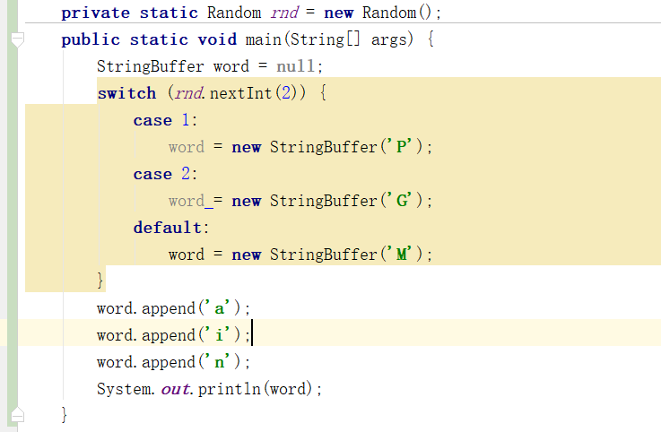

## 1.问题描述
### 今天在查看代码的时候，偶然发现在Controller某个接口在调用的时候,其中涉及到的bean均为null,显然是未注入进去，然而调用其它接口时，涉及到的bean可以被注入进去，经过检查比对是因为方法访问修饰符错误。
## 1.2.得到的结论
```
    @RequestMapping作用于private方法，该请求可以映射出去，但是如果方法中用到了@Autowired自动注入的bean，则该bean无法注入，为null
```
## 2.问题描述
### 如下代码会输出什么

```
    private static Random rnd = new Random();

    public static void main(String[] args) {
        StringBuffer word = null;
        int i = rnd.nextInt(2);
        switch (i){
            case 1:
                word = new StringBuffer('P');
            case 2:
                word = new StringBuffer('G');
            default:
                word = new StringBuffer('M');
        }
        word.append('a');
        word.append('i');
        word.append('n');
        System.out.println(word);
    }

```
**注意StringBuffer中是char类型的，进入的构造方法，会与预想结果不同，实际输出为“ain”,如果是default参数是“M” （字符串）则最后会输出“Main”。此问题需注意两个问题，一个是case,无break时候的穿透问题，一个是会Stringbuffer的参数问题**
